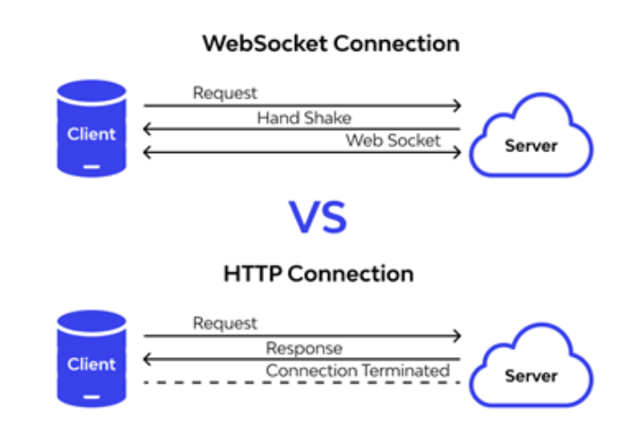

# Intro to full stack

## N-tier architecture

1\. Layers: virtual separations of different parts

2\. Tiers: physical separations of different parts

  

### 3-tier - N-tier application

make applications efficient

i.e. 

Code - server1

Database - server2

  

3 tier

1\. client tier - presentation tier (Thin clients-don't run business logic) communicate with app, present data

2\. applicatoin tier

3\. data tier

 
4 tier

...

4\. delivery tier

  \- CDN providers: HTML, CSS, JavaScript, Image ->delivery

## client - server architecture 

1. Adv
    - separation of the different layers of your application
 2. Disadv
     - ou have to spend time configuring, managing, and maintaining the servers to keep them in working order