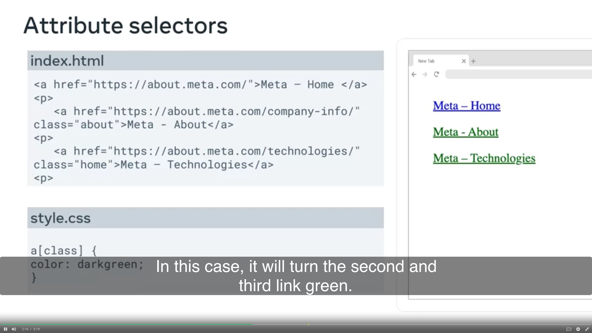
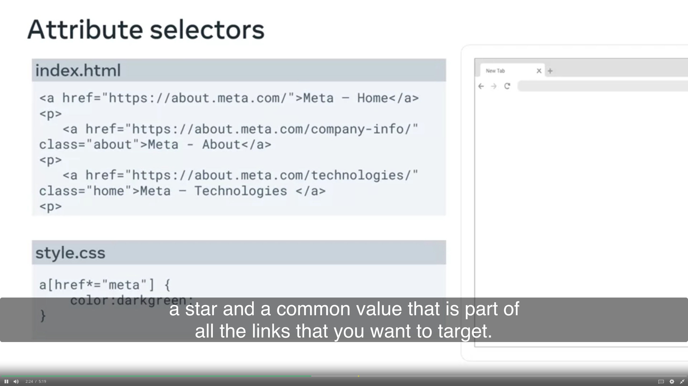
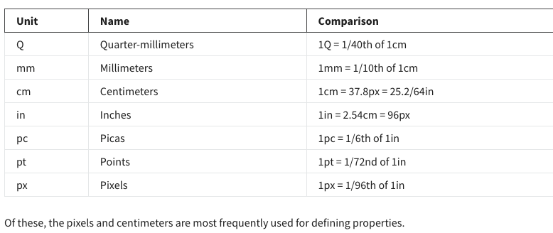
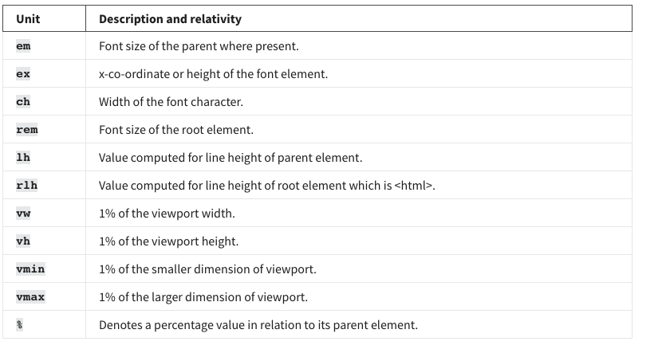

# CSS
1. enhance the appearance
2. Flex, boxes, grids
3. Modify fonts, color, size, layouts
4. Finding by id tag


1. Flexbox - flexible responsice design
 ```css
#sample{
    display: flex;
}

#sample{
    display: grid;
}
```
- create flexible elements in small scales

## Widely used selectors
1. Element / Type Selectiors - select based on the element's type
2. ID selectors
3. Calss selectors

### Attribute selectors
```css

```
1. Specific

2. Multiple



```css
li:nth-of-type(2){
    color: aqua;
}

li:nth-child(2){
    color: aqua;
}
```

### Star selector - universe selector 
```css
* {
    color: blue;
}
```

### Group selector / selector stacking
```css
h1, p {
    color: blue;
}
```
adding a driver

### Absolute Units & Relative Values
1. Absolute Units


2. Relative Values


## Document flow - block vs. inline
1. span
2. div
- The block elements begin on a new line and span the new page
- The inline elements work within the flow of surrounding content rather than breaking onto their own line
```css
#middle {
    display: inline; 
}
```

## Basic flexbox
1. Design elements & easy layouts

1. search bar
2. navigation bar - highly responsible on different devices 
3. image gallery

```html
<!DOCTYPE html>
<html>
<head>
    <link rel="stylesheet" href="flexbox3_search.css">
</head>
    
<body>
<div class="container">
    
    <input class="searchBox" type="search" name="search" placeholder="Enter text here.. ">
    <input type="submit" value="Search" class="searchButton">
</div>
</body>
</html>
```

```css
.container{
    display: inline-flex; # behave like a inline element
    flex: 1 1 300px;
    border-radius: 10px;
    border: 1px solid #ccc;
    overflow: hidden; # would be the text entered in the search query
}
.icon{
    padding: 0.8rem;
}
.searchBox{
    birder: 0;
    flex: 1;
}
.searchButton{
    color: white;
    background: #0f4a8a;
    border: 0;
    padding: 0.8rem;
    border-radius: 8px;
}
```

#### Navigation 
```html
<!DOCTYPE html>
<html>
<head>
    <link rel="stylesheet" href="flexbox3_search.css">
</head>
    
<body>
<ul class="container">
    <li> <a href="#"> Home </a></li>
    <li> <a href="#"> Blog </a></li>
    <li> <a href="#"> Menu </a></li>
    <li> <a href="#"> Contact Me </a></li>
</ul>
    
</body>
</html>
```

#### Image gallery
```html
<!DOCTYPE html>
<html>
<head>
    <link rel="stylesheet" href="flexbox3_search.css">
</head>
    
<body>
    <div class="container">
        
        
        
        
        
        
    </div>
    
</body>
</html>
```

## CSS Grid
```css
.container{
    display: grid;
}
```
## Pseudo-class selectore
1. :hover
2. :active
3. :focus
4. :disabled and :enabled
5. :chekced and :indeterminate
6. :valid and :invalid  - case of fields like emails and phone numbers

### Specific position-based states
1. :first-of-type
2. :last-of-type
3. :nth-of-type()
4. :nth-last-of-type()