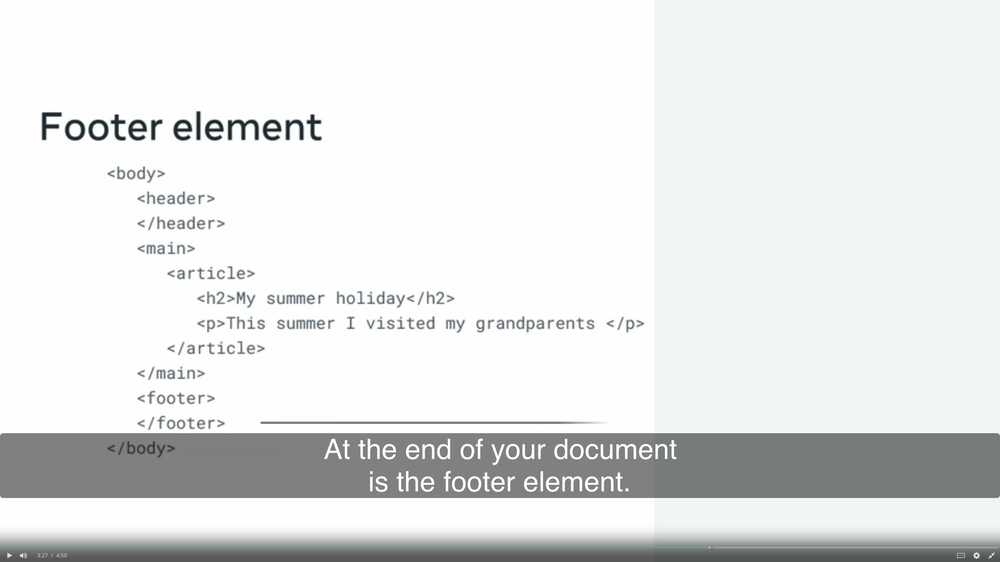

# HTML
1. HTML: share information on the rinternat
2. CSS: stylesheet langiage, layout and look. Separate with content and style

## Semantic tags and why we need them
1. tag
    - Heading tag <H1/>

### Basic HTML page Structure
1. Article: independent content

2. Section: different section
    - doesn't require the article

### Hyper Text Markup Language
1. return to the webpage: index.html
2. Opening tag
3. Closing tag
4. self-closing tag

HTML5

### Semantic tags in action
ul for unordered tags

### Forms Validation
1. Client-side validation
2. Server-side validation
    <input type = "email">
    
### Form Submission
1. HTTP Get
2. HTTP Post

- POST is securer than GET: The HTTP POST method is more secure than the HTTP GET method. When a form is submitted using the Post method, the form data is inserted into the content of the HTTP request instead of appended at the end of the URL as is done with the GET method.

- URL length limited by browser
- URL length limited by web server
- Security Threat